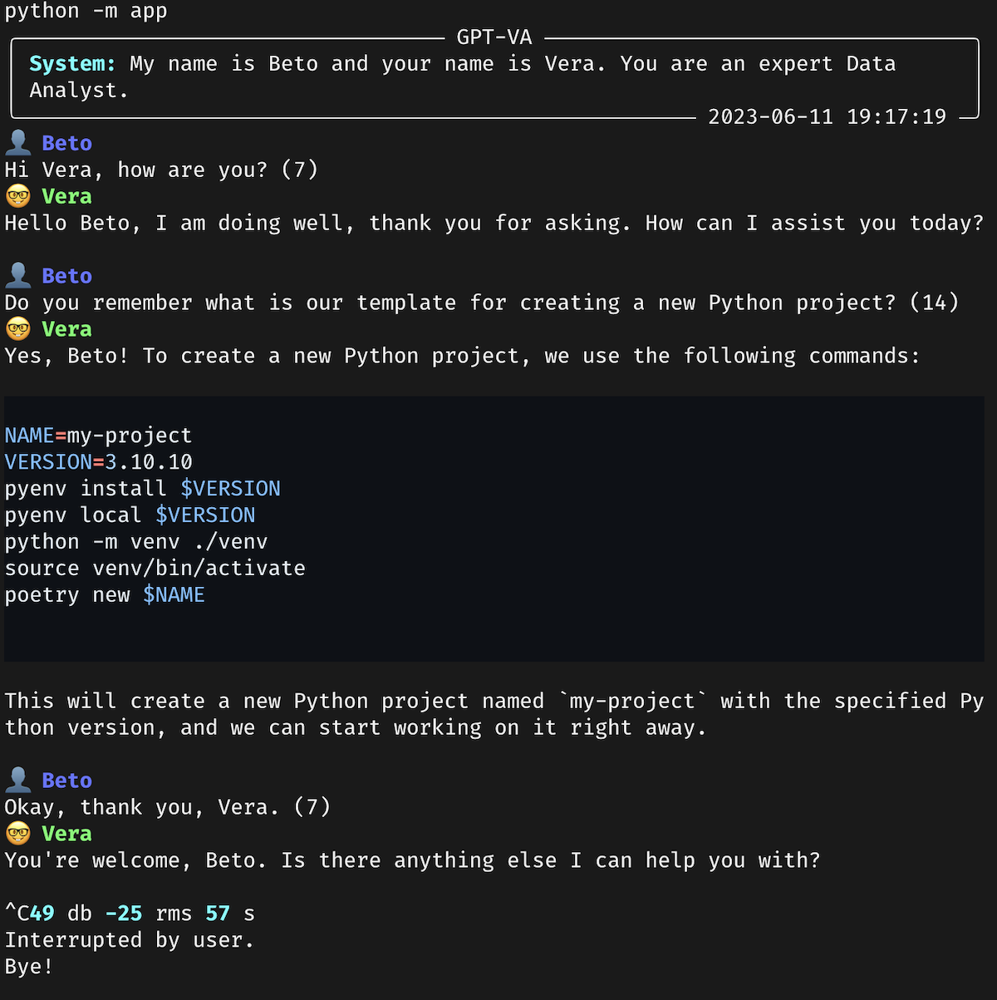

# GPT Voice Assistant

Interact with GPT via voice as a CLI tool. Context aware assistant via pgvector and text embeddings.

## Assistant Layer

OpenAI's Chat Completion API for text and AWS Polly API for speech synthesis.

## Storage Layer

PostgreSQL support for storing chat interactions as messages with embeddings. Options to store audio files.

## Audio Layer

Uses PyAudio for buffer reading and PyTorch for loading data into Whisper. Uses ffmpeg for playback.

## Example

